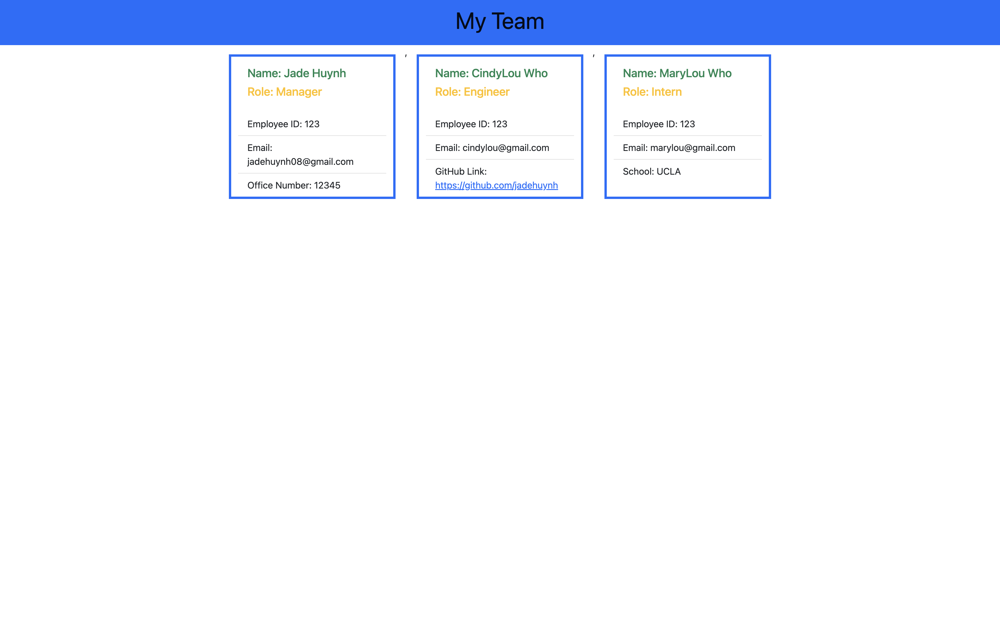
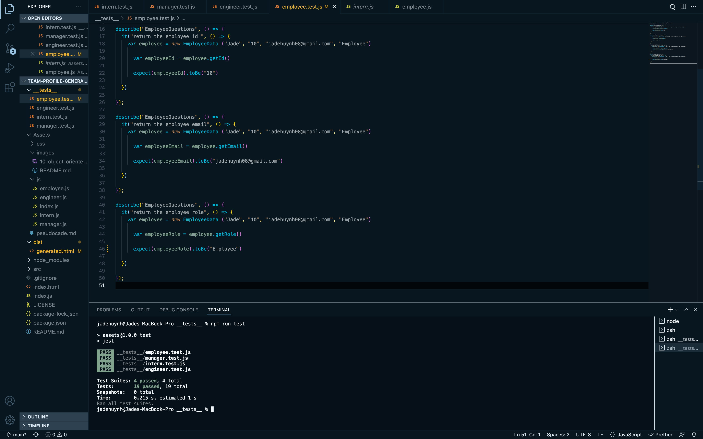

# Team Profile Generator
----
#### Welcome to My Team Profile Generator!

This generator will help you organize and display your team and info for each member in an organized way.

As a role of a Manager, you will add Engineers and or Interns (employees) to oyur roster. Prompts will display messages asking for specific questions per each member. You can add as many employees as needed, providing contact information as well as specific information to pertaining to each of their roles. Managers will be asked to provide an office number, Engineers will provide their GitHub user name, and Interns will provide what school they attended.

Passed tests shows the accurate functionality of the code in displaying the data on a generated HTML document in the "dist" folder. 

----
### [Live Video Demo]()
----
### [GitHub Link](https://jadehuynh.github.io/team-profile-generator/)

----
## My Team Format

----
## Passed Test Functions

